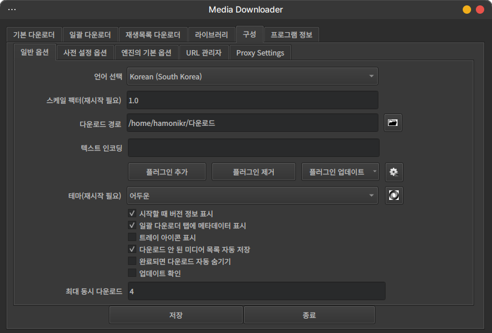

# media-downloader

이 프로젝트는 하모니카 OS 에서 유튜브 다운로드나 aria2c, wget 및 사파리 북 같은 도구를 별도의 터미널 옵션을 몰라도 쉽게 사용할 수 있는 프로그램 입니다.

- Auto detect dark theme
- Auto detect locale
- Add Korean translation

upstream : https://github.com/mhogomchungu/media-downloader

## Screenshots

# License

This program is free software: you can redistribute it and/or modify it under the terms of the GNU General Public License as published by
the Free Software Foundation, either version 2 of the License, or (at your option) any later version.

This program is distributed in the hope that it will be useful, but WITHOUT ANY WARRANTY; without even the implied warranty of
MERCHANTABILITY or FITNESS FOR A PARTICULAR PURPOSE.  See the GNU General Public License for more details.
